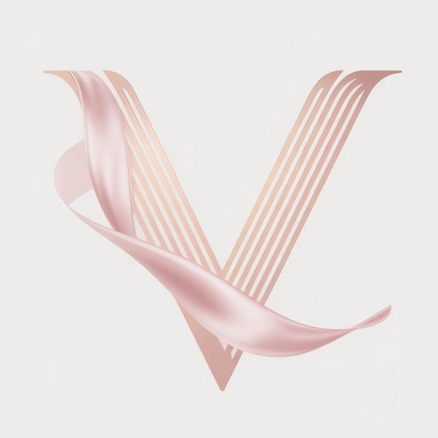
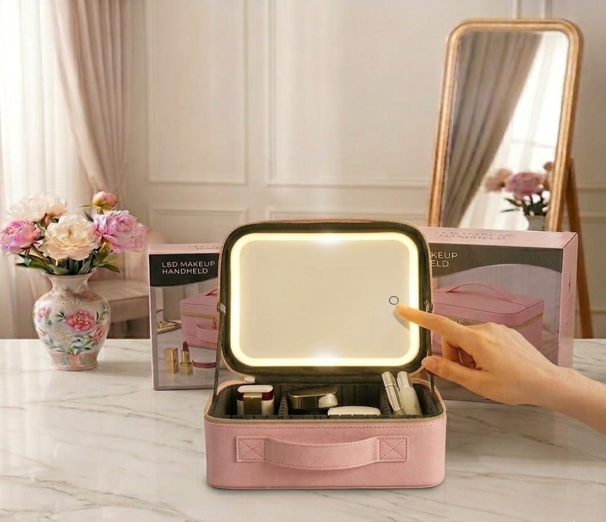
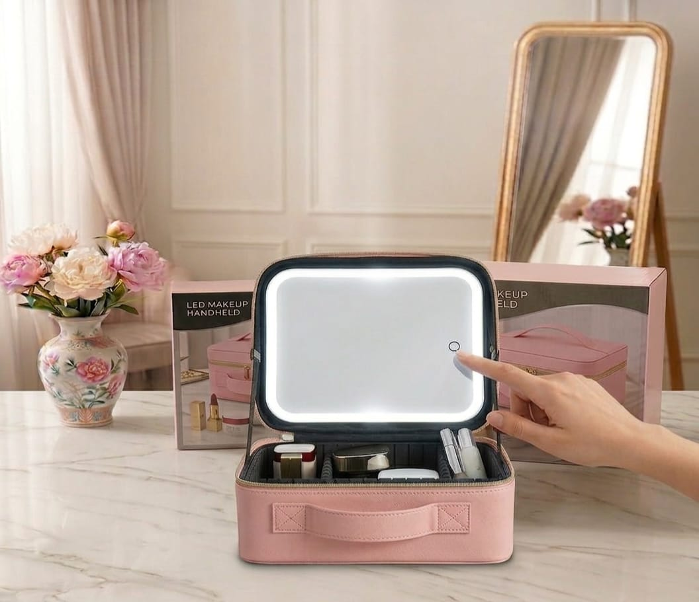
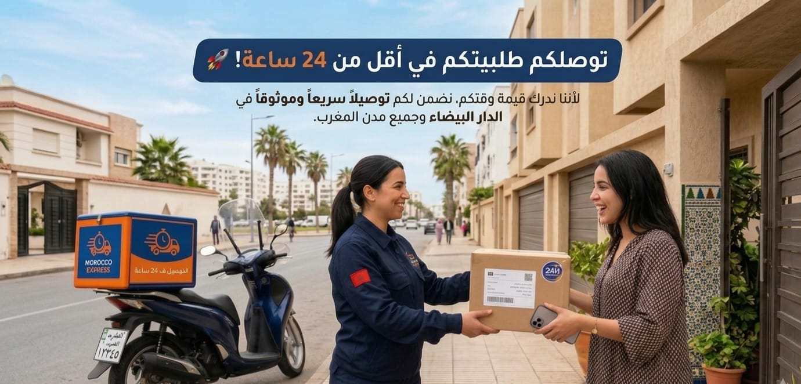

<html lang="ar" dir="rtl">
<head>
    <meta charset="UTF-8">
    <meta name="viewport" content="width=device-width, initial-scale=1.0">
    <title>VELORIA BEAUTY - العرض المتكامل</title>
    <link href="https://fonts.googleapis.com/css2?family=Cairo:wght@400;700&display=swap" rel="stylesheet">
    
</head>
<body>

    <header class="brand-header">
        
        VELORIA BEAUTY
    </header>

    
🚚 توصيل مجاني + الدفع عند الاستلام 🤝

    

        
مدة الخصم تنتهي في:

        
--:--:--

        
خصم حصري على المجموعة كاملة

    

    <section class="hero">
        
        

            479 درهم 
            319 درهم فقط 
            أطلبي الآن واستفيدي من عرض محدود
        

        
✨ حقيبة واسعة بـ "فواصل ذكية" تقدري تشكلي مساحتها وتصغريها كيفما بغيتي على حساب ماكياجك!

    </section>

    

        <h3>مرآة ذكية احترافية 💡</h3>
        

            

أبيض طبيعي

            

أصفر دافئ

            

أبيض ناصع

        

        

            <h4>تفاصيل ومميزات المرآة:</h4>
            <ul>
                <li><strong>إضاءة LED ذكية:</strong> 3 مستويات من الإضاءة كتحكمي فيها باللمس.</li>
                <li><strong>قابلة للفصل والشحن:</strong> تقدري تحيديها وتخدمي بها بوحدها، وكتشارجا بـ USB.</li>
                <li><strong>بطارية ليتيو قوية:</strong> كتدوم مدة طويلة بلا ما تحتاجي تشارجيها كل نهار.</li>
                <li><strong>وضوح عالي:</strong> زجاج نقي كيبين تفاصيل الماكياج بكل دقة.</li>
            </ul>
        

    

    

        
    

    

        <h3>نظمي مجوهراتك بكل أناقة 💍</h3>
        
        
        

            <h4>مميزات علبة المجوهرات:</h4>
            <ul>
                <li><strong>تنظيم ذكي:</strong> مقسمة للخواتم، السلاسل، والحلقات باش ما يتلفوش ليك.</li>
                <li><strong>حجم مثالي:</strong> كتجي وسط الحقيبة وما كتاخدش مساحة كبيرة.</li>
                <li><strong>حماية فائقة:</strong> مغلفة بمادة رطبة من الداخل كتحمي المجوهرات من الخدوش.</li>
                <li><strong>تصميم أنيق:</strong> تقدري تهزيها معاك بوحدها فالمناسبات أو السفر.</li>
            </ul>
        

    

    <section class="faq-section">
        <h2 class="faq-title">أسئلة كيسولوها البنات 🤔</h2>
        

واش بصح التوصيل فابور؟

نعم أختي، التوصيل مجاني لجميع المدن المغربية والدفع حتى كتوصلك الأمانة.

        

شحال كيبقى شحن المرآة؟

البطارية قوية بزاف، تقدري تخدمي بها حتى لـ 10 أيام بشحنة وحدة.

        

إلى وصلاتني ولقيت فيها شي مشكل؟

عندنا ضمان الجودة! إلى كان أي عيب، كنبدلوها ليك فوراً أو كنرجعو ليك فلوسك.

        

واش الحقيبة والعلبة كيجيو مجموعين؟

نعم، العرض كيشمل الحقيبة الذكية + علبة المجوهرات + كابل الشحن بـ 319 درهم فقط.

        

واش الحقيبة جلد؟

نعم، المادة الخارجية من الجلد الاصطناعي الفاخر، ساهل في التنظيف وكيحمي المحتويات.

        

            

شحال كياخد التوصيل من وقت؟

بين 24 و 48 ساعة كحد أقصى كيكون الطلب عندك.

            

واش نقدر نغسل الحقيبة؟

يفضل تمسحيها غير بقطعة قماش مبللة باش تحافظي على الجلد والدوائر الكهربائية.

            

واش المرايا فيها ألوان بزاف؟

فيها 3 ديال الدرجات (أبيض طبيعي، أصفر دافئ، وأبيض ناصع).

            

واش العلبة د المجوهرات كتهز بزاف؟

نعم، مقسمة بذكاء باش تهز ليك كاع السلاسل والخواتم اللي كتحتاجي.

            

كيفاش نطلب العرض؟

كليكي على زر الواتساب التحت، صيفطي المعلومات ديالك وحنا نتواصلو معك.

        

        <button class="btn-outline" id="btnFaq" onclick="toggleMore('extraFaq', 'btnFaq', 'أسئلة')">إظهار المزيد من الأسئلة</button>
    </section>

    <section class="reviews-container">
        <h2>آراء البنات اللي جربوا المجموعة ⭐</h2>
        

            
            

⭐⭐⭐⭐⭐
نهيلة - الرباط
المرايا واعرة والضوء فيها مجهد كيعاون فالمكياج. العلبة د المجوهرات نفعاتني بزاف في التنظيم!

        

        

            
            

⭐⭐⭐⭐⭐
إلهام - كازا
جودة طوب! الحقيبة كتهز بزاف والعلبة د الخواتم كيجيو فيها مستفين. شكراً فيلوريا.

        

        

            
            

⭐⭐⭐⭐⭐
سلمى - فاس
أحسن باك خديت هاد العام، المرايا كتحيد وهادشي نفعني بزاف فالسفر. العلبة الصغيرة كلاس بزااف.

        

        

            

                
                

⭐⭐⭐⭐⭐
إيمان - طنجة
السلعة واصلة كيفما فالصور تماماً. المرايا كتشارجا دغيا وكتصبر، والحقيبة الجلد ديالها رطب وزوين.

            

            

                
                

⭐⭐⭐⭐⭐
مريم - مراكش
بصراحة صدماتني الجودة! الحقيبة متينة وكتحمي الماكياج والمرايا فيها إضاءة بروفيسيونال.

            

            

                
                

⭐⭐⭐⭐⭐
حنان - أكادير
تعامل راقي وتوصيل سريع. الحقيبة والعلبة جاو مجموعين ومقادين، عجبوني بزاف كهدية.

            

            

                
                

⭐⭐⭐⭐⭐
كوثر - القنيطرة
المرآة ذكية بزاف، نفعاتني حيت كنقدر نحيدها ونخدم بها برا الحقيبة. شكراً ليكم.

            

        

        <button class="btn-outline" id="btnReviews" onclick="toggleMore('extraReviews', 'btnReviews', 'الآراء')">إظهار المزيد من الآراء</button>
    </section>

    <section class="final-proof">
        <h2>توصيل سريع ومضمون 🚀</h2>
        
        
فيلوريا تضمن لك جودة عالية وتوصيل سريع لجميع مدن المغرب.

    </section>

    

    
<a href="https://wa.me/212691444558" class="cta-btn">اطلبي الآن عبر الواتساب</a>

    
</body>
</html>
